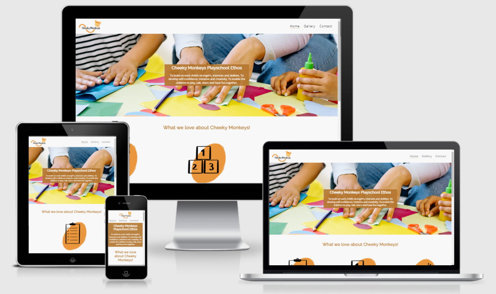
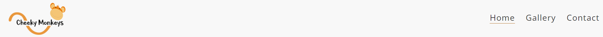
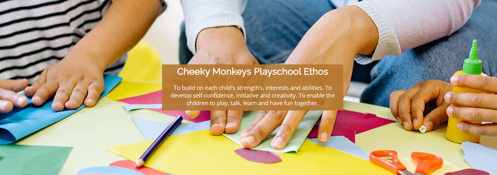
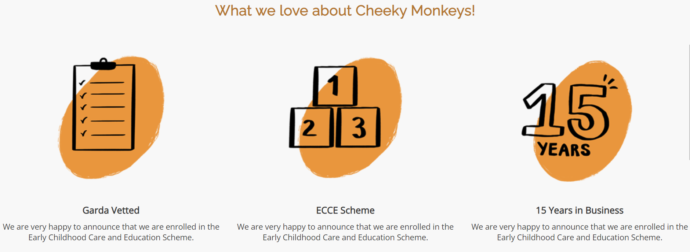
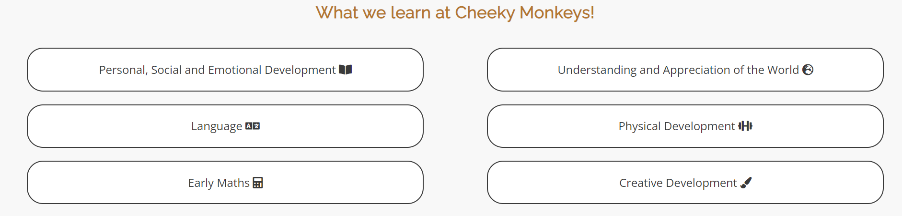
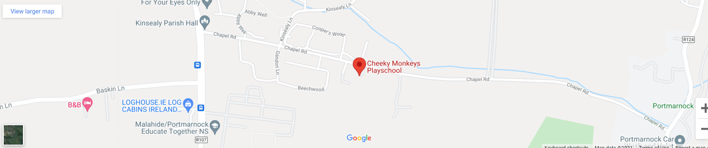
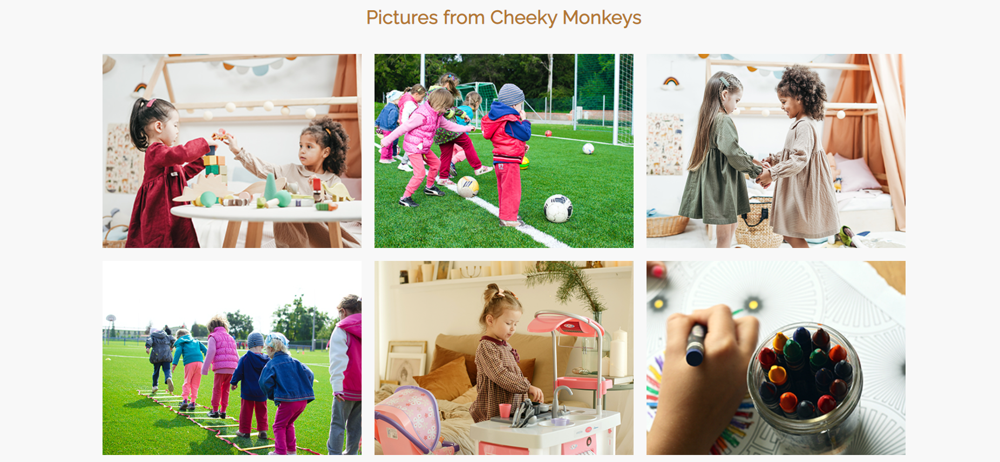
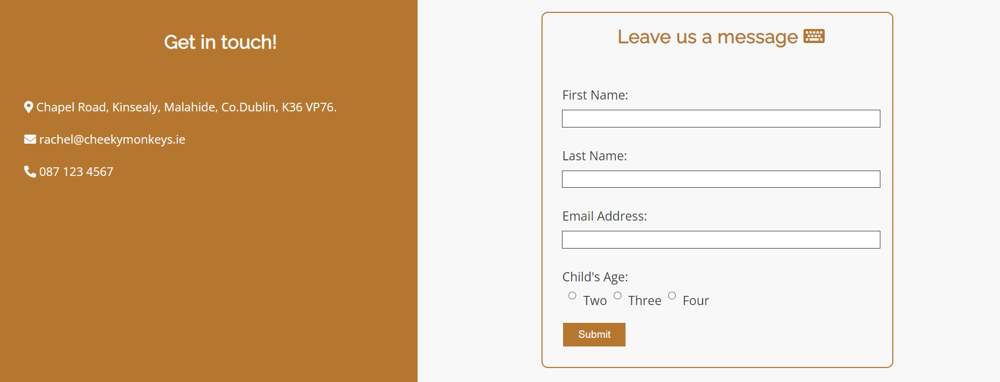

# Cheeky Monkeys Playschool 

Cheeky Monkeys Playschool needed a website with their current one having been created over 10 years ago and has an extremely outdated look and feel. The new, updated website features three images showcasing the greatest benefits that Cheeky Monkeys have to offer. Six key teachings the children will learn while attending, a full gallery that features the children at play, the owner's contact details and a contact form.

**The business goals of this website:**
* Provide a new and updated website.
* Display the key benefits & curriculum of attending Cheeky Monkeys Playschool.
* Have a gallery to show pictures of children.
* Most importantly, show the contact details for the playschool and a contact form for the owner to contact them.

**The customer goals of this website are:**
* Clear, easy and intuitive to use website.
* To easily know the location of Cheeky Monkeys Playschool.
* To be able to contact Cheeky Monkeys Playschool via phone, email or contact form.

## Features

### Navigation Bar Header

* The header/ navigation bar features on all three pages of the website. This features the logo, home page, gallery and contact us to allow for easy navigation. The logo takes you back the user back to the home page.

* This allows users to navigate to any page, at any time, on any device.

### Hero Image Section

* This section features a hero image and cover text displaying the Cheeky Monkeys Playschool ethos.

### What We Love About Cheeky Monkeys

* Three key images, designed to quickly demonstrate the key three benefits that Cheeky Monkeys Playschool offer. 

* A grow animation has been added to the three images. This has been set to a duration of 5 seconds as I am limited with my knowledge of JavaScript, in the future I would like this set to trigger when the images come into view and reduce the duration to 1 second.

### What We Learn At Cheeky Monkeys

* The What We Learn section lists six key teachings at Cheeky Monkeys.

* This allows the business to demonstrate the value they can offer to customers and allows clients to view what their children will be learning.

### Map Section

* Allows customers to easily identify the location of Cheeky Monkeys Playschool via Google Maps.

### Footer

* The footer section features the Cheeky Monkeys address, navigation links that mirror the navigation links in the header, social links and the copyright.

* The navigation links allow easy navigation to any page on the website if the user has scrolled to the bottom of the page. The social links allow parents to keep in touch.

### Gallery Page

* The gallery page allows the business to upload pictures of children doing activities and learning. This allows for the business to show social proof.

* For the parents/ customers it allows them to see children playing and learning or viewing their own children.

### Contact Us Page

* The left hand side displays the address, email address and phone number of Cheeky Monkeys Playschool.

* The right hand side is a contact form that allows the user to leave their details and the owner of Cheeky Monkeys will contact them.

## Features Left to Implement